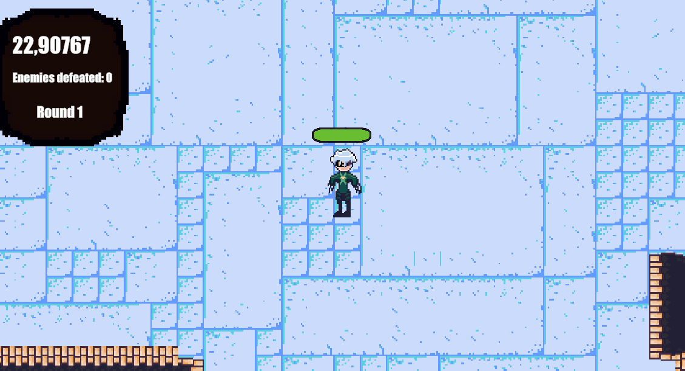
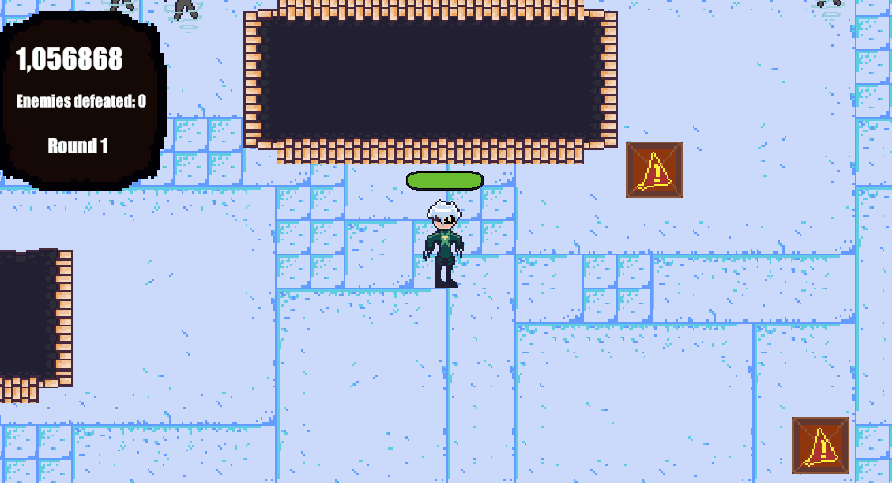
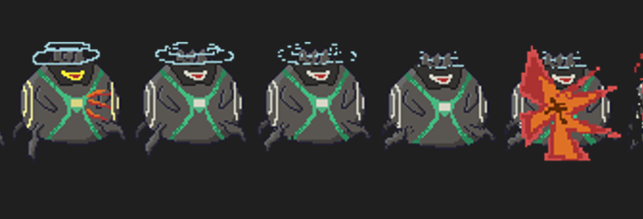
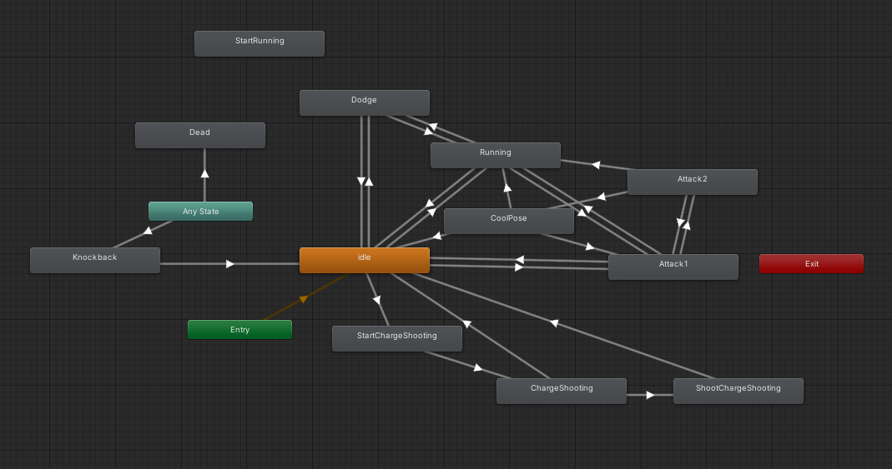
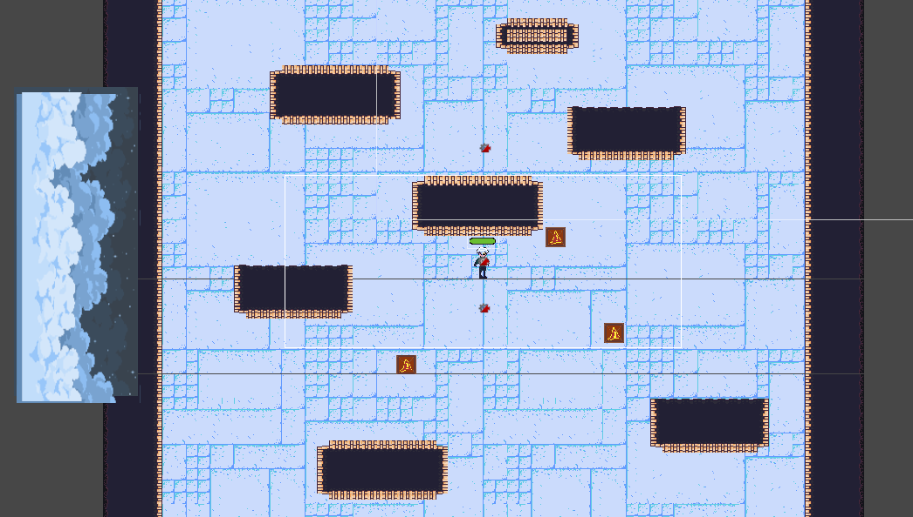
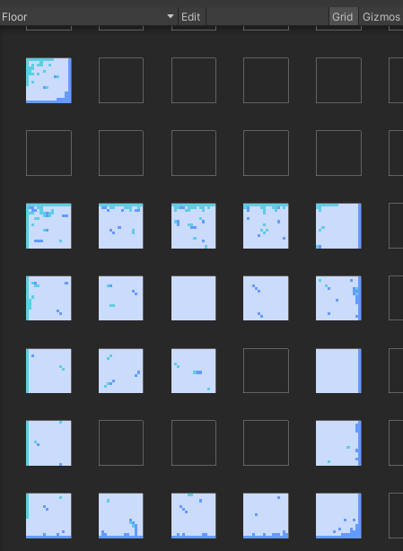
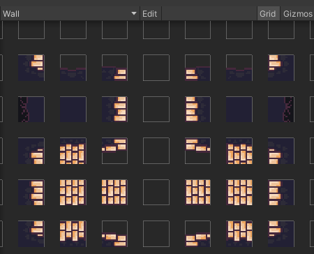
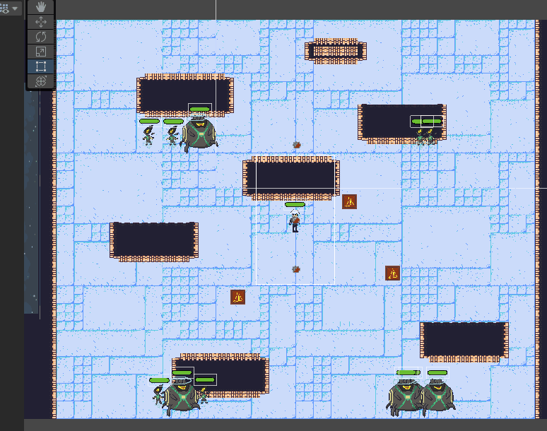
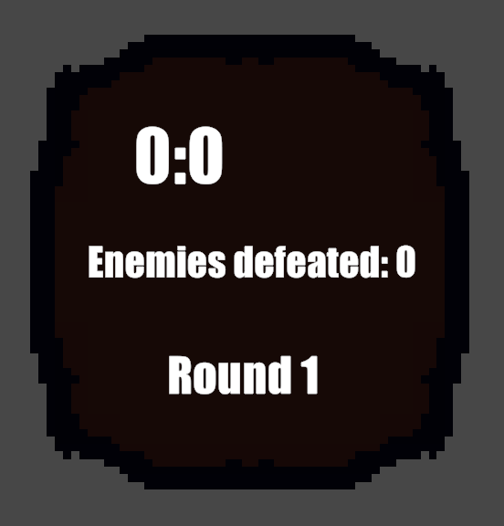

# Prototype FDV.
## Author: Álvaro González Rodríguez
alu0101202556

## About the prototype

This is an approach to a roguelike 2D game where you control a ciborg and need to defend yourself against ordes robots enemies. This game have a lot of emphasis on fighting.

## The player

 * Movement

The character can move in every direction, meaning that this is not a platform game and the camera is simulating that it is at the top of the scene, looking down at the player. He has the number of 8 scripts associated with him just to make him walk, fight, shoot, use the objects that are in the scene and react to them. There are also some scripts who manages how the level works.

He also uses a 2D capsule collider and a 2D rigidbody but, because there isn't gravity, I opted to make him move as a kinematic body type. It have a distance joint which I will explain its functionality later and the rest of component are just to make the game more appealing to the player, with the animator and the audio source components.

I also need to mention that the design of the character (and the rest of the game) was made by me in Aseprite, including all of the animation and special effects. Here we can see part of the code for the character horizontal movement, where I check some conditions just to make him move.

	float horizontal = Input.GetAxisRaw("Horizontal");
    float vertical = Input.GetAxisRaw("Vertical");
    if(canMove && animator.GetBool("isDead") == false)
    {
        animator.SetBool("isKnockback", false);
        if(horizontal != 0){
            Vector3 childScale = gameObject.transform.GetChild(1).transform.localScale;
            if(horizontal == -1) {
                this.transform.localScale = new Vector3(-5.0f,5.0f,1.0f);
                if(childScale.x > 0) 
                    gameObject.transform.GetChild(1).transform.localScale = new Vector3(-childScale.x, childScale.y, childScale.z);
            } else {
                this.transform.localScale = new Vector3(5.0f,5.0f,1.0f);
                if(childScale.x < 0) 
                    gameObject.transform.GetChild(1).transform.localScale = new Vector3(-childScale.x, childScale.y, childScale.z);
            }
            //No uso fisicas asi que lo muevo con el Transate si no tendria que utilizar algo parecido a -> rigidBody2D.velocity = new Vector2(h, rigidBody2D.velocity.y);
            transform.Translate(Vector3.right * horizontal * Time.deltaTime * speed);
            animator.SetBool("isRunning", true);
        } /*else {
            rigidBody2D.velocity = new Vector2(0.0f,rigidBody2D.velocity.y);
        }*/
		
		... Rest of the movement ...

The player can also dodge some attacks from the enemies. In this state, the player will not recieve any damage from the enemies and will move a little faster to the direction of the mouse. To accomplish that I created a variable *isDodging* who will be used in the collision with other objects, if it is true, it will not calculate the damage and will not change the state to knockback. There is a cooldown in this action.

In this moment I also use an event to comunicate between the attack script and the movement script, the event name is *blockAttacking* and is called when the character is doing an action that blocks the attack actions, as its name says.

	if(Input.GetKey(KeyCode.LeftShift) && Time.time > rechargeDodge + lastDodge)
    {
        blockAttacking(false);
        canMove = false;
        animator.SetBool("isDodging", true);
        dodgeGoal = Input.mousePosition;
        dodgeGoal = Camera.main.ScreenToWorldPoint(dodgeGoal);
        dodgeGoal.z = 0.0f;
        dodging = true;
        lastDodge = Time.time;
    }

As i said early, the player will enter in a knockup state when the player receive enought damage. It will end in the last frame of its animation using an animation event.

	if(dodging && animator.GetBool("isKnockback") == false)
    {
        dodgeDirection = dodgeGoal-transform.position;
        //transform.position = Vector3.MoveTowards(transform.position, dodgeDirection.normalized, speed * 2 * Time.deltaTime);
        if(dodgeDirection.magnitude > dodgeAccuracy && Time.time < lastDodge + 0.3f)
        {
            transform.Translate(dodgeDirection.normalized * Time.deltaTime * speed * 3);
        }else{
            blockAttacking(true);
            animator.SetBool("isDodging", false);
            dodging = false;
            canMove = true;
        }
    }
	
	if(animator.GetBool("isKnockback") && animator.GetBool("isDead") == false)
    {
        Vector3 knockDirection = (-horizontal) * Vector3.right + (-vertical) * Vector3.up;
        transform.Translate(knockDirection * Time.deltaTime * speed * 3);
    }
	
	//Called in the animator
    public void FinishKnockback()
    {
        animator.SetBool("isKnockback", false);
        canMove = true;
    }
	

 * Atacck

The player needs to defens himseft, so I created some actions to help him! If the player can attack, it can do a basic 2 attack combo or, if he has done all the conditions, he can shoot a powerfull attack. All of this actions end with an animation event, like the knockback state.

To record when the character hit something, there is a second collider who activates when the player is doing an attack animation and, with its own script, it manages the damage that the enemy will receive

The powerfull attack is a laser that the player can shoot. It has its own script and is used to calculate the damage that the enemies will receive

There is also another event, named *movement* to comunicate to the movement script when he can move, because if he is attacking he cannot move

	//Basic 2 attack combo
    if(Input.GetMouseButtonDown(0))
    {
        movement(false);
        if(animator.GetBool("isAttacking1") == false){
            ShakeCamera.Instance.ShakeCam(2.0f, 0.1f);
            animator.SetBool("isAttacking1", true);
        } else {
            ShakeCamera.Instance.ShakeCam(2.0f, 0.1f);
            animator.SetBool("isAttacking2", true);
        }        
    }
    //Charge attack
    if(Input.GetKeyDown(KeyCode.Q) && canChargeAttack && ready == false)
    {
        movement(false);
        animator.SetBool("isChargingAttack", true);
        downTime = Time.time;
        pressTime = downTime + countDown;
        ready = true;
    }
    if (Input.GetKeyUp(KeyCode.Q)) {
        animator.SetBool("isChargingAttack", false);
        ready = false;
    }
    if (Time.time >= pressTime && ready == true) {
        animator.SetBool("isChargingAttack", false);
        animator.SetBool("isShootingChargeAttack", true);
        SoundManagerScript.PlaySound("charge");
        ShakeCamera.Instance.ShakeCam(5.0f, 1.0f);
        ready = false;

        Vector3 shootGoal = Input.mousePosition;
        shootGoal = Camera.main.ScreenToWorldPoint(shootGoal);
        shootGoal = shootGoal - transform.position;
        shootGoal.Normalize();
        float rot_z = Mathf.Atan2(shootGoal.y, shootGoal.x) * Mathf.Rad2Deg;

        GameObject bulletInstance = Instantiate(chargeBullet, transform.position, Quaternion.identity);
        Physics2D.IgnoreCollision(GetComponent<Collider2D>(), bulletInstance.GetComponent<Collider2D>()); 
        bulletInstance.GetComponent<MainChargeAttack>().SetDirectionBullet(rot_z);

    }
    //The player can move if he is not attacking
    if(animator.GetBool("isAttacking1") == false && animator.GetBool("isAttacking2") == false && animator.GetBool("isChargingAttack") == false && animator.GetBool("isKnockback") == false)
    {
        movement(true);
    }

 * Properties, react to enviroment and healthbar

The main character has a lot of properties, base health, actual health, base damage, boost damage, charge attack damage, ... , who needs to be in constant use. I opted to create a script just for this purpose

The character will make an action when he touches a enemy, a bullet or a wall.

Every character of the level will have a healthbar above his head.

## Enemies

 * Base script

All of the enemies of the level define the abstract class *Enemy*, they need to define, at least, how they respond to the damage, because the behaviour of the enemies are defined in the animator.

In this specific level, there are two enemies, one of them can shoot at the player and the other one needs to approach the player to hit him. They have the same components, the base script, a capsule collider, a rigidbody and a animator.

The enemy who shoots at the player uses a pool of bullets who will be created when the enemy is initialized, for performance purposes.

 * Behaviour scripts

Using the animator, I implemented two behaviour for the enemies, one of them is move to the target and other to attack the player. The two enemies share the move to target script, but the attack one is different

This is the move to target:

	override public void OnStateUpdate(Animator animator, AnimatorStateInfo stateInfo, int layerIndex)
    {
        float speed = animator.GetComponent<Enemy>().getSpeed();

        var enemyPos = animator.GetComponent<Transform>().position;
        var heading = player.transform.position - enemyPos;
        var distance = heading.magnitude;
        var direction = heading / distance;

        thisObject.Translate(direction * Time.deltaTime * speed);
        if(animator.GetComponent<Enemy>().getType() == "FWM01" && Vector3.Distance(player.transform.position, thisObject.position) < 10.0f)
        {
            animator.SetBool("isAttacking", true);
        } else if(animator.GetComponent<Enemy>().getType() == "TWM01" && Vector3.Distance(player.transform.position, thisObject.position) < 3.0f)
        {
            animator.SetBool("isAttacking", true);
        }
    }
	

And this is the shoot to target from the first enemy, where we can see the pooling in action.

	override public void OnStateUpdate(Animator animator, AnimatorStateInfo stateInfo, int layerIndex)
    {
        if(Time.time > lastShoot + shootCooldown)
        {

            var enemyPos = animator.GetComponent<Transform>().position;
            var heading = player.transform.position - enemyPos;
            var distance = heading.magnitude;
            var direction = heading / distance;
            
            if (heading.sqrMagnitude > maxRange * maxRange) {
                animator.SetBool("isAttacking", false);
            } else if(currentShoot != maxShoots){
                bullets[index].SetActive(true);
                SoundManagerScript.PlaySound("enemyShot");
				currentShoot++;
                Physics2D.IgnoreCollision(animator.GetComponent<Collider2D>(), bullets[index].GetComponent<Collider2D>()); 
                bullets[index].GetComponent<BulletFWM01>().SetDirectionBullet(direction);
                lastShoot = Time.time;
				index++;
            } else if(Time.time > lastShoot + rafageCooldown){
                currentShoot = 0;
				index = 0;
            }
			
			if(index > animator.GetComponent<FWM01>().size)
			{
				index = 0;
			}
        } 
    }

 * The bullets

Like the enemies, there is an abstract class of bullets and every enemy that can shoot will implement it. The script for it just make the calculations of its movement. The *DestroyBullet* method doesn't actually destroy the bullet but put the set active in the object in false.

	void FixedUpdate()
    {
        rb.velocity = direction * bulletSpeed;
        if(Time.timeSinceLevelLoad - initializationTime > 5.0f)
        {
            this.gameObject.SetActive(false);
        }
        if(animator.GetBool("isDestroy"))
        {
            bulletSpeed = 0.0f;
            bulletDmg = 0.0f;
        }
        GameObject[] otherObjects = GameObject.FindGameObjectsWithTag("Bullet");

        foreach (GameObject bullet in otherObjects) {
            Physics2D.IgnoreCollision(bullet.GetComponent<Collider2D>(), GetComponent<Collider2D>()); 
        }
		
		if(rb.velocity.x <= 0.5f && rb.velocity.y == 0.5f)
		{
			DestroyBullet();
		}
    }

## Animations

 * Player animations

We can count six main actions there, an idle, combo attack, charge attack, running, dodging, knockback and dead states. They change thanks to some boolean variables and are managed all over the character scripts, as we saw early.

The animator for the enemies are almost the same, I just change the behaviour script depending on the type of enemy. They basically have a no attacking state, where they are moving to the target, an attacking state and a damaged state.

## The scene

 * Level script
 
 
This script manages some variables related to the game difficulty and progress. It saves the time that the player have been playing the game, the number of enemies that the player has killed and the current round. It also manages the number of enemies that will be in the scene, when they can spawn and when the round will be completed. We will se later how the spawner works

 
	void Update()
    {
        time.text = Time.time.ToString();
        enemies.text = "Enemies defeated: " + player.GetComponent<MainAttack>().GetEnemiesDefeated();
        roundText.text = "Round " + round;

        if(player.GetComponent<MainAttack>().GetEnemiesDefeated() >= nextRound)
        {
            round++;
            nextRound = nextRound * 2;
            if(timeBetweenSpawn > 1.0f)
                timeBetweenSpawn -= 0.5f;
            numberEnemiesPerSpawn++;
            maxNumberOfEnemies += maxNumberOfEnemies + 5;
        }

        if(Time.time > nextSpawn)
        {
            nextSpawn = Time.time + timeBetweenSpawn;
            player.GetComponent<MoveFloor>().SpawnEnemies(numberEnemiesPerSpawn, maxNumberOfEnemies);
        }
    }

 * Tilemap

The scene is composed with a rectangular tilemap, wich is separated in 6 pivots. This pivots mark a part of the scene where some enemies can appear and how the maps move and will look.

There isn't actually a background but a floor, like I said in the beginning, it is not a platformer. This floor have only a tilemap and a tilemap renderer because the player can move freely over them. Then we have the wall and the obstacles, they use a different tile palette and have a static rigidbody with a tilemap and composite collider.

The map is basically infinite, the player can move up or down all he wants, so we need to move the background up or down too. To accomplish that the main character have a script to move the floors when they are out of the camera sight.

	float size = cameraMain.GetComponent<Camera>().orthographicSize;
	float spacing = reference.GetComponent<Renderer>().bounds.size.y;

	//SI ESTA EN LA SEGUNDA FILA Y BAJA EL FONDO DE ARRIBA DEL TODO AHORA ESTA ABAJO DEL TODO
	if(cameraMain.transform.position.y < floorALeft.position.y && secondRow == true){
		floorBLeft.position = floorALeft.position - Vector3.up * spacing;
		floorBRight.position = floorARight.position - Vector3.up * spacing;
		secondRow = false;
		thirdRow = true;
	//SI ESTA EN LA SEGUNDA FILA Y SUBE EL FONDO DE ABAJO DEL TODO AHORA ESTA ARRIBA DEL TODO
	} else if(cameraMain.transform.position.y > floorBLeft.position.y && secondRow == true){
		floorALeft.position = floorBLeft.position + Vector3.up * spacing;
		floorARight.position = floorBRight.position + Vector3.up * spacing;
		secondRow = false;
		firstRow = true;
	}
	... It repeat another two times for the other floors ...

To render all of the sprites correctly, there are different layers in the tilemap and sprite renderer

 * Parallax effect

There is a parallax effect at the left of the scene with moves vertically. The material have a vertical image attach to it to move the texture it in the Y axis.

 * Spawner

The spawner it's very straightforward, it has a create enemy who will be called every time the level requires a new enemy and a generate method which decides with a *Random.Range()* method which enemy will be generated.

Then we need a place to put the spawner and, because the level will be constantly moving, I place them in the pivots. It will generate the enemies only in the pivots that are far away from the player.

 * Cinemachine

For the camera, we use the cinemachine. It will follow the player and make some special actions when some keys are pressed. For example, if the player presses the N key, the camera will transite to another virtual camera that is above the character, the same will happen when he presses the M key, he will look down.

The camera will also shake when the player attack, it changes the amplitude and duration depending on the attack that the player is doing.

	void Update()
    {
        if(shakeTime > 0)
        {
            shakeTime -= Time.deltaTime;
            if(shakeTime <= 0.0f)
            {
                perlin.m_AmplitudeGain = 0.0f;
            }
        }
    }

    public void ShakeCam(float amplitude, float time)
    {
        perlin.m_AmplitudeGain = amplitude;
        shakeTime = time;
    }

 * TNT boxes

This is a special object who will damage all of the enemies in a determinate area. It has a a box collider, a rigidbody, a base script and a second collider who will activate when a enemy touches the box. The player can interact with it pressing the C key, it will attach the bodies of the two objects. When they are in this state, if the player press the F key, a random force will move the object. It can desactivate the joint pressing the X key.

	void Update()
    {
        if(touched == true &&Time.time >= downTime)
        {
            Destroy(gameObject);
        }
    }

    private void OnTriggerEnter2D(Collider2D other) {
        if(other.gameObject.tag == "Enemy")
        {
            circle.enabled = true;
            other.gameObject.GetComponent<Enemy>().respondToDamage(100, other.gameObject.name);
            downTime = Time.time + 3.0f;
            touched = true;
        }
    }

## UI

 * Healthbar

There is an healthbar above every object in the scene that has health. It has its own script who manages how it looks

 * Level info

The level info can be seen in the left corner. It has a special font.

## Music and sounds

The character has a audio source to play all of the special effects that there will be in the scene. It is managed by a script who plays all of the sounds that is implemented in the game. There are a charge attack sound, an enemy shot sound and two enemy death sounds.

The background music is located in a empty object who has another audio source. It play an audio clip wich is looping.

You can look al the sounds and a technical explanation in this link - [Presentation]()